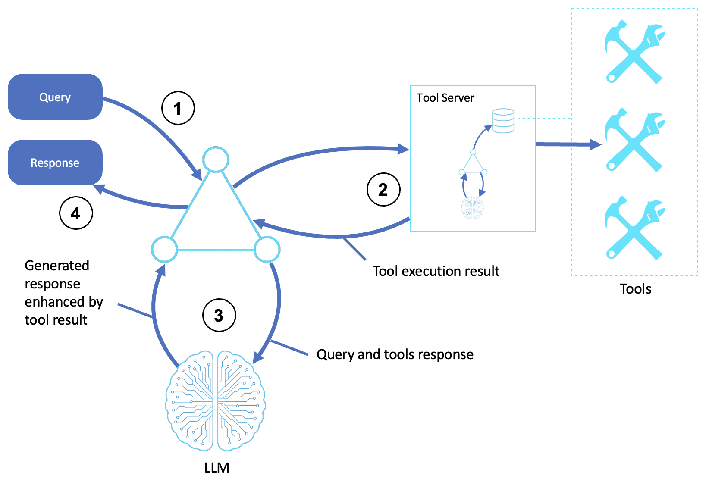

# Tool-Based Agents for Servers

Agents that delegate tool execution to an external server with its own runtime, gaining isolation, independent scaling, and specialized reasoning instead of running every tool inline.

This sample covers building and connecting MCP tool servers with the [Strands Agents SDK](https://strandsagents.com/) and is based off of the [AWS Prescriptive Guidance - Tool-based agents for servers pattern](https://docs.aws.amazon.com/prescriptive-guidance/latest/agentic-ai-patterns/tool-based-agents-for-servers.html).

## Table of Contents

- [Quick Start](#quick-start)
- [MCP Server and Client](#mcp-server-and-client)
  - [How It Works](#how-it-works)
  - [Creating an MCP Server](#creating-an-mcp-server)
  - [Connecting an Agent](#connecting-an-agent)
  - [Using Published Servers](#using-published-servers)
  - [Transport Options](#transport-options)
- [Intelligent Tool Server](#intelligent-tool-server)
  - [Why Not Just Add More Tools?](#why-not-just-add-more-tools)
  - [A Server with Its Own Subagent](#a-server-with-its-own-subagent)
- [AWS Implementation Patterns](#aws-implementation-patterns)
- [Reference](#reference)

## Quick Start

**Prerequisites:**
- Python 3.10+
- An AWS account with Amazon Bedrock access
- AWS credentials configured (`aws configure`) with permission to invoke models on Bedrock
- [`uv`](https://docs.astral.sh/uv/) (provides the `uvx` command) — only for the published-server example, installed by `requirements.txt`

```bash
# Create and activate virtual environment
python3 -m venv venv
source venv/bin/activate  # On Windows: venv\Scripts\activate

# Install dependencies
pip install -r requirements.txt

# Point the sample at your AWS profile and region (loaded by shared/model.py)
cp .env.example .env
# Edit .env: set AWS_PROFILE and AWS_REGION. Optionally pin a model with STRANDS_MODEL_ID.

# --- Calculator server (two terminals) ---
# Terminal 1: start the calculator MCP server (port 8000)
python mcp_server.py
# Terminal 2: connect an agent to it
python mcp_agent.py

# --- Intelligent server (two terminals) ---
# Terminal 1: start the analysis server with its own subagent (port 8001)
python tool_server_agent.py
# Terminal 2: point the same client at port 8001
python mcp_agent.py http://localhost:8001/mcp/

# --- Published server over stdio (single terminal, needs uvx) ---
python mcp_stdio_agent.py
```

> **Note:** This sample runs outside the usual single-command pattern because tool servers are, by definition, separate processes. The calculator server (8000) and the intelligent server (8001) use **different ports**, so you can have both running at once.

**Try these exercises:**
1. **Add a server tool.** Add a new `@mcp.tool` (e.g., `modulo`) to `mcp_server.py`, restart it, and confirm the agent picks it up with no client change.
2. **Point the client at the intelligent server.** Run `python mcp_agent.py http://localhost:8001/mcp/` and ask it to "analyze the sales data."
3. **Swap in a published server.** Change `mcp_stdio_agent.py` to a different server from the [MCP Servers Directory](https://github.com/modelcontextprotocol/servers) and see what tools it exposes.
4. **Inspect the tools.** Before sending a query, print `mcp_client.list_tools_sync()` to see exactly what the server advertised.

---

## MCP Server and Client

The [Model Context Protocol (MCP)](https://modelcontextprotocol.io) standardizes how an agent talks to a tool server: the server advertises its tools, the agent discovers them at connection time, and tool execution happens in the server's process rather than the agent's. The calculator example lives in the [calculator server](mcp_server.py) and the [MCP client](mcp_agent.py).

### How It Works

1. **Receives query**: A user or system submits a request to the agent shell; the agent interprets it and prepares to dispatch to a tool server
2. **Runs tool server processes**: The agent sends the task and structured parameters to a tool server, which may run scripts in dedicated compute, use its own subagent for LLM reasoning, manage retries, or handle multistep execution flows
3. **Uses LLM reasoning with tool output**: The agent invokes an LLM, passing the original query and the tool server result, and the LLM synthesizes a response that incorporates the new information
4. **Returns a response**: The agent returns a natural-language or structured response to the user or calling system



### Creating an MCP Server

[`MCPServer`](https://github.com/modelcontextprotocol/python-sdk) (called `FastMCP` in mcp 1.x) turns decorated functions into a server. You get routing, schema generation, and transport handling for free:

```python
from mcp.server.mcpserver import MCPServer

mcp = MCPServer("Calculator Server")

@mcp.tool(description="Add two numbers together")
def add(x: float, y: float) -> float:
    """Add two numbers and return the result."""
    return x + y

@mcp.tool(description="Multiply two numbers together")
def multiply(x: float, y: float) -> float:
    """Multiply two numbers and return the result."""
    return x * y

if __name__ == "__main__":
    # port=8000 so it won't collide with the intelligent server on 8001
    mcp.run(transport="streamable-http", port=8000)  # serves at http://localhost:8000/mcp/
```

### Connecting an Agent

The [`MCPClient`](https://strandsagents.com/docs/user-guide/sdk/tools/mcp-tools/) handles the connection lifecycle and tool discovery. Open it as a context manager, list the tools, and hand them to the agent:

```python
from mcp.client.streamable_http import streamable_http_client
from strands import Agent
from strands.tools.mcp import MCPClient

mcp_client = MCPClient(lambda: streamable_http_client("http://localhost:8000/mcp/"))

with mcp_client:
    tools = mcp_client.list_tools_sync()      # discover what the server offers
    agent = Agent(tools=tools, callback_handler=None)
    response = agent("What is 25 multiplied by 4?")  # agent picks the multiply tool
    print(response)
```

`mcp_agent.py` takes an optional URL argument, so the same client connects to either server: `python mcp_agent.py http://localhost:8001/mcp/`.

### Using Published Servers

You don't have to write every server. The MCP ecosystem publishes ready-to-use servers as packages, listed in the [MCP Servers Directory](https://github.com/modelcontextprotocol/servers). The **stdio** transport spawns the server as a subprocess and talks to it over stdin/stdout. The [stdio agent](mcp_stdio_agent.py) uses the AWS Documentation server this way:

```python
from mcp import stdio_client, StdioServerParameters
from strands import Agent
from strands.tools.mcp import MCPClient

mcp_client = MCPClient(lambda: stdio_client(
    StdioServerParameters(command="uvx", args=["awslabs.aws-documentation-mcp-server@latest"])
))

# Managed approach: pass the client itself as a tool; Strands handles the lifecycle
agent = Agent(tools=[mcp_client], callback_handler=None)
response = agent("What is AWS Lambda?")
```

| Package manager | Command | Example |
|-----------------|---------|---------|
| Python (uvx) | `uvx package@version` | `uvx awslabs.aws-documentation-mcp-server@latest` |
| Node.js (npx) | `npx -y @scope/package` | `npx -y @modelcontextprotocol/server-filesystem` |

### Transport Options

MCP supports several [transport mechanisms](https://modelcontextprotocol.io/docs/concepts/transports). This sample runs servers locally.

| Transport | Use case | Example |
|-----------|----------|---------|
| **stdio** | Local/CLI tools, published servers | `uvx some-mcp-server` |
| **Streamable HTTP** | Web services | `http://localhost:8000/mcp/` |
| **SSE** | Streaming results | `http://localhost:8000/sse` |

---

## Intelligent Tool Server

A tool server doesn't have to be a thin wrapper around functions. The primary agent dispatches a high-level task, and the server's subagent figures out how to accomplish it. The full example is in the [intelligent analysis server](tool_server_agent.py).

### Why Not Just Add More Tools?

The obvious alternative is to give the primary agent every tool directly. That breaks down as the toolset grows:

| Concern | All tools on the primary agent | Subagent per domain |
|---------|-------------------------------|---------------------|
| Tool selection | LLM chooses from 50+ tools | LLM chooses from 3–5 high-level actions |
| Context window | Bloated with every tool schema | Lean; details stay on the server |
| Specialization | One prompt covers everything | Each server has a domain-specific prompt |
| Maintenance | Change one tool, redeploy the whole agent | Update servers independently |
| Security | Primary agent holds all credentials | Credentials isolated per server |

### A Server with Its Own Subagent

The server exposes one high-level `analyze` tool. Behind it, an internal agent with its own tools and prompt does the multi-step work:

```python
from mcp.server.mcpserver import MCPServer
from strands import Agent, tool

mcp = MCPServer("Intelligent Analysis Server")

# Internal tools — only the server's subagent uses these
@tool
def load_data(source: str) -> str:
    """Load data from a source (simulated)."""
    ...

@tool
def calculate_trend(values: str) -> str:
    """Calculate a trend from comma-separated values (simulated)."""
    ...

# The server's internal agent: domain expertise + specialized tools
internal_agent = Agent(
    system_prompt="You are a data analysis expert...",
    tools=[load_data, calculate_trend, generate_summary],
    callback_handler=None,
)

# The only tool exposed to clients — it hides all of the above
@mcp.tool(description="Perform AI-powered data analysis with automatic insights")
def analyze(data_source: str, question: str) -> str:
    """Analyze data using the server's own AI agent."""
    return str(internal_agent(f"Analyze the '{data_source}' data and answer: {question}"))

if __name__ == "__main__":
    mcp.run(transport="streamable-http", port=8001)  # serves at http://localhost:8001/mcp/
```

The primary agent connects exactly like it did to the calculator. It just sees `analyze`, `list_sources`, and `quick_calc` instead of a sprawl of low-level tools. That is the controller/dispatcher idea at the heart of this pattern: the primary agent stays lightweight and delegates the heavy, specialized work.

---

## AWS Implementation Patterns

| Pattern | Description | Reference |
|---------|-------------|-----------|
| AWS Lambda-hosted MCP tool servers | Deploy stateless MCP tool servers as AWS Lambda functions for auto-scaling, pay-per-use agent tools | [Effectively building AI agents on AWS Serverless](https://aws.amazon.com/blogs/compute/effectively-building-ai-agents-on-aws-serverless/) |
| Containerized MCP servers on Amazon ECS | Run long-lived MCP tool servers on Amazon ECS with warm caches, persistent connections, and enterprise networking | [Deploying Model Context Protocol (MCP) servers on Amazon ECS](https://aws.amazon.com/blogs/containers/deploying-model-context-protocol-mcp-servers-on-amazon-ecs/) |
| Amazon Bedrock AgentCore Gateway for API-to-MCP | Zero-code transformation of existing APIs and AWS Lambda functions into MCP-compatible tools with built-in auth and discovery | [Introducing Amazon Bedrock AgentCore Gateway](https://aws.amazon.com/blogs/machine-learning/introducing-amazon-bedrock-agentcore-gateway-transforming-enterprise-ai-agent-tool-development/) |
| Amazon API Gateway → AgentCore Gateway | Expose existing REST APIs to agents via MCP by connecting Amazon API Gateway as an AgentCore Gateway target | [Connect API Gateway to AgentCore Gateway with MCP](https://aws.amazon.com/blogs/machine-learning/streamline-ai-agent-tool-interactions-connect-api-gateway-to-agentcore-gateway-with-mcp/) |
| Amazon SageMaker AI model endpoints as agent tools | Fine-tune models for agentic tool calling and deploy as Amazon SageMaker AI endpoints that agents invoke | [Accelerate agentic tool calling with serverless model customization in Amazon SageMaker AI](https://aws.amazon.com/blogs/machine-learning/accelerate-agentic-tool-calling-with-serverless-model-customization-in-amazon-sagemaker-ai/) |

## Reference

- [Companion blog post: Delegating Work: Tool Servers and the Model Context Protocol](Delegating%20Work%20-%20Tool%20Servers%20and%20the%20Model%20Context%20Protocol.md)
- [AWS Prescriptive Guidance - Tool-based agents for servers](https://docs.aws.amazon.com/prescriptive-guidance/latest/agentic-ai-patterns/tool-based-agents-for-servers.html)
- [Model Context Protocol](https://modelcontextprotocol.io)
- [Strands MCP tools documentation](https://strandsagents.com/docs/user-guide/sdk/tools/mcp-tools/)
- [Amazon Bedrock User Guide](https://docs.aws.amazon.com/bedrock/latest/userguide/what-is-bedrock.html)

### The series

This sample is one of eleven, one per pattern in the [AWS Prescriptive Guidance on agentic AI patterns](https://docs.aws.amazon.com/prescriptive-guidance/latest/agentic-ai-patterns/). Each has a hands-on sample repository and a companion blog post explaining the concepts.

| # | Pattern | Sample | Blog |
|---|---|---|---|
| 01 | Basic Reasoning Agents | [sample-basic-reasoning-agents](https://github.com/aws-samples/sample-basic-reasoning-agents) | [Building Basic Reasoning Agents with Amazon Bedrock and Strands SDK](https://github.com/aws-samples/sample-basic-reasoning-agents/blob/main/Building%20Basic%20Reasoning%20Agents%20with%20Amazon%20Bedrock%20and%20Strands%20SDK.md) |
| 02 | Tool-Based Agents (Functions) | [sample-tool-based-agents-functions](https://github.com/aws-samples/sample-tool-based-agents-functions) | [Extending AI Agents with Custom Tools and Functions](https://github.com/aws-samples/sample-tool-based-agents-functions/blob/main/Extending%20AI%20Agents%20with%20Custom%20Tools%20and%20Functions.md) |
| 03 | Tool-Based Agents (Servers) | this repository | [Delegating Work: Tool Servers and the Model Context Protocol](Delegating%20Work%20-%20Tool%20Servers%20and%20the%20Model%20Context%20Protocol.md) |
| 04 | Computer-Use Agents | [sample-computer-use-agents](https://github.com/aws-samples/sample-computer-use-agents) | [Agents That Use Computers: Browsers, Desktops, and the GUI Frontier](https://github.com/aws-samples/sample-computer-use-agents/blob/main/Agents%20That%20Use%20Computers%20-%20Browsers%2C%20Desktops%2C%20and%20the%20GUI%20Frontier.md) |
| 05 | Coding Agents | [sample-coding-agents](https://github.com/aws-samples/sample-coding-agents) | [Coding Agents: From Autocomplete to Autonomous Software Work](https://github.com/aws-samples/sample-coding-agents/blob/main/Coding%20Agents%20-%20From%20Autocomplete%20to%20Autonomous%20Software%20Work.md) |
| 06 | Speech and Voice Agents | [sample-speech-voice-agents](https://github.com/aws-samples/sample-speech-voice-agents) | [Giving Agents a Voice: Speech-to-Speech and the STT/TTS Pipeline](https://github.com/aws-samples/sample-speech-voice-agents/blob/main/Giving%20Agents%20a%20Voice%20-%20Speech-to-Speech%20and%20the%20STT-TTS%20Pipeline.md) |
| 07 | Workflow Orchestration Agents | [sample-workflow-orchestration-agent](https://github.com/aws-samples/sample-workflow-orchestration-agent) | [Orchestrating Agents: Sequential, Parallel, and Conditional Workflows](https://github.com/aws-samples/sample-workflow-orchestration-agent/blob/main/Orchestrating%20Agents%20-%20Sequential%2C%20Parallel%2C%20and%20Conditional%20Workflows.md) |
| 08 | Memory-Augmented Agents | [sample-memory-augmented-agents](https://github.com/aws-samples/sample-memory-augmented-agents) | [Agents That Remember: Context Windows, Summaries, and Persistent Sessions](https://github.com/aws-samples/sample-memory-augmented-agents/blob/main/Agents%20That%20Remember%20-%20Context%20Windows%2C%20Summaries%2C%20and%20Persistent%20Sessions.md) |
| 09 | Simulation and Test-Bed Agents | [sample-simulation-testbed-agents](https://github.com/aws-samples/sample-simulation-testbed-agents) | [Practice Worlds: Simulation and Test-Bed Agents](https://github.com/aws-samples/sample-simulation-testbed-agents/blob/main/Practice%20Worlds%20-%20Simulation%20and%20Test-Bed%20Agents.md) |
| 10 | Observer and Monitoring Agents | [sample-observer-monitoring-agents](https://github.com/aws-samples/sample-observer-monitoring-agents) | [Watching the Watched: Observer and Monitoring Agents](https://github.com/aws-samples/sample-observer-monitoring-agents/blob/main/Watching%20the%20Watched%20-%20Observer%20and%20Monitoring%20Agents.md) |
| 11 | Multi-Agent Collaboration | [sample-multi-agent-collaboration](https://github.com/aws-samples/sample-multi-agent-collaboration) | [When Multi-Agent Collaboration Earns Its Cost](https://github.com/aws-samples/sample-multi-agent-collaboration/blob/main/When%20Multi-Agent%20Collaboration%20Earns%20Its%20Cost.md) |

## Security

See [CONTRIBUTING](CONTRIBUTING.md#security-issue-notifications) for more information.

## License

This library is licensed under the MIT-0 License. See the LICENSE file.
